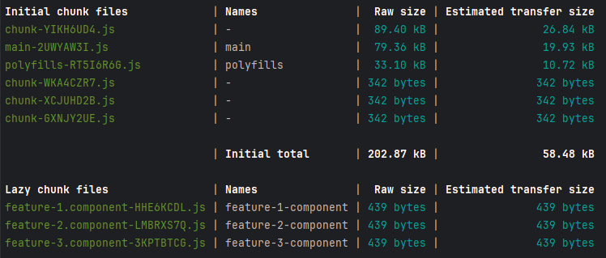
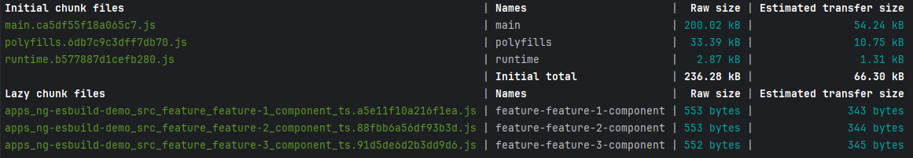

# NgEsbuildDemo

Demo the differences with bundle size and number of chunks using esbuild vs webpack in angular.

## Motivation

Understand what the differences when bundling with esbuild and webpack.

Understand what can be done to optimize the output of esbuild.

## Description

This repo contains one app that has both `build-angular:browser-esbuild` and `build-angular:browser`.

The application has a root component named `AppComponent`, this is loaded synchronously and will always be in the main bundle.

It has 3 Feature Components which each have a route, and it has 3 Ui Components.  

All 3 Ui Components are used in the AppComponent, and each feature component imports one of the Ui Components.

### Build commands

Command for esbuild:

```bash
nx run ng-esbuild-demo:build-esbuild:production
```

Command for webpack:

```bash
nx run ng-esbuild-demo:build-webpack:production
```

### Result

Esbuild generates 3 additional chunks but the initial chunk files is smaller by `33.41 kB`.

Additionally, it is generating chunks for code that is required in the initial load. 
Since all 3 Ui Components are in the initial bundle they do no require being split into a new chunk.

**EsBuild Output**


**Webpack Output**

